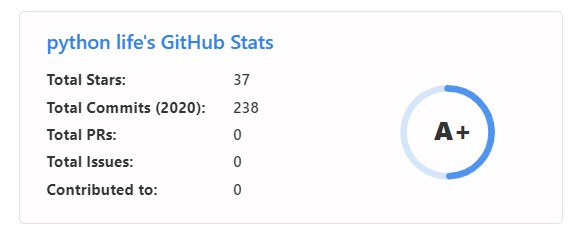

# github

## Showing icons
 To enable icons, you can pass show_icons=true in the query param, like so:
``

``

## All inbuilt themes :-
# dark, radical, merko, gruvbox, tokyonight, onedark, cobalt, synthwave, highcontrast, dracula

## Themes
# With inbuilt themes, you can customize the look of the card without doing any manual customization.

Use ?theme=THEME_NAME parameter like so :-

``

``
## GitHub Stats Card

``

``
